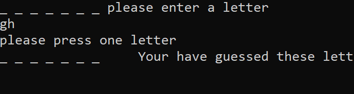

# lab03-WordGuessGame

This a game to guess a word by guessing letter by letter. 

You can always start a new game after you finishe one and you can 

manage the words in the file(add/delete)

Home page will be like this:

Now you can choose what you want to do, if you want to start a game, press "1"

Now you can type one letter to guess the word,if your guess letter exsits in the random word,it will show the letter 
above the underscore and you can see those, and on the right side, is your guess history telling you what you have been typed

But you can only type one letter a time, you can't type bunch letters at a time

After you figure it out what the word is, it will show you that word and ask you if you want to start a new game or not

If you choose start a new game, it will show you a new game,otherwise just go back to the home page

Now if you want to choose "2" on the home page,you will enter a new page called "Admin"

You have 4 choices here: view all the words in the file, add new words to the file, delete some word you don't like and go back to 
home page

if you choose "1" to view all the words it will output all the words on the console

After that you can press any key to go back to the admin page, now you can choose "2" to add a word to the file

You can type a word and press enter

But if you type something has number in it, it will tell you that is not a word and nothing should be added to the document

If you type a space,still will not be added

If you type some special characters , still nothin will be added to the file

Now we go back to Admin and choose"3" to delete a word

Result will be like this:
 

And after this go back to Admin, and from Admin press "4" to go back to the home page.

Have Fun!

